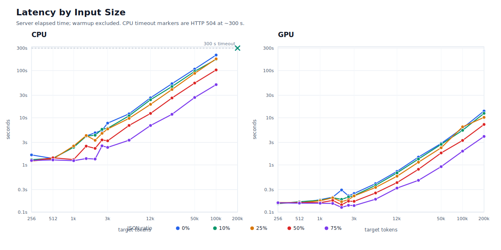
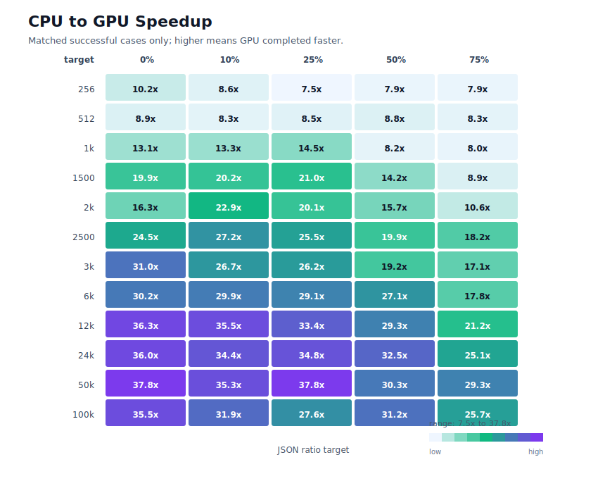
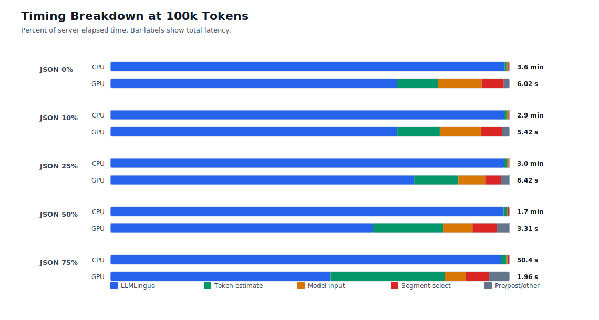
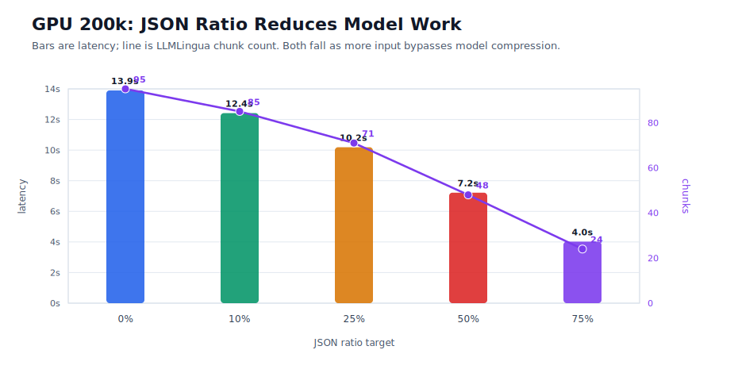
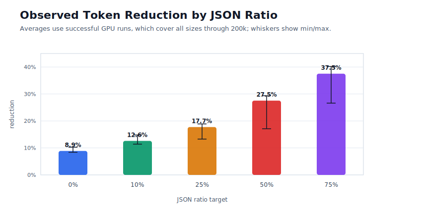

# Benchmark Performance Rundown

Generated: 2026-07-05

Source files:

- `C:/Users/troym/Downloads/benchmark-cpu-2-6gb.jsonl`
- `C:/Users/troym/Downloads/benchmark-gpu.jsonl`

Warmup rows (`measured=false`) are excluded from summaries. CPU timeout rows are shown as failures, not as completed latency measurements.

## Executive Summary

- The GPU is the right execution target for this workload. Across the 60 matched successful CPU/GPU cases, GPU median speedup is **22.1x**; the range is **7.5x to 37.8x**.
- Speedup grows with input size. At 24k tokens and above, matched cases have median speedup of **32.5x**.
- CPU tops out before the 200k pure-prose and 10% JSON cases under the current 300 second request limit. The GPU completes the full 200k matrix in **4.0 s to 13.9 s**, depending on JSON ratio.
- Large CPU cases are almost entirely LLMLingua time: roughly **98% to 99%** at 50k and 100k. On GPU, LLMLingua is still the largest component, but token estimation, model input preparation, and segment selection become material.
- More JSON/TOON content reduces model-fed text and chunk count. At 200k on GPU, chunks fall from **95** at 0% JSON to **24** at 75% JSON, and latency falls from **13.9 s** to **4.0 s**.
- Observed compression improves as JSON ratio rises: average token reduction increases from **8.9%** at 0% JSON to **37.5%** at 75% JSON.

## Run Coverage

| Device | Measured | OK | Errors | Largest completed target | 200k result | Median throughput tokens/s |
| --- | --- | --- | --- | --- | --- | --- |
| CPU | 62 | 60 | 2 | 100,000 | 0/2 ok; 2 timeout/error | 540 |
| GPU | 65 | 65 | 0 | 200,000 | 5/5 ok | 15,607 |

CPU failures:

- `tok200000_json0`: HTTP 504 after 300.4 s client wall time.
- `tok200000_json0p1`: HTTP 504 after 300.5 s client wall time.

## Latency and Speedup

## 100k Snapshot

| JSON ratio | CPU 100k | GPU 100k | GPU speedup | GPU 200k | GPU 200k chunks | Reduction at 100k |
| --- | --- | --- | --- | --- | --- | --- |
| 0% | 3.6 min | 6.02 s | 35.5x | 13.9 s | 95 | 8.4% |
| 10% | 2.9 min | 5.42 s | 31.9x | 12.4 s | 85 | 12.4% |
| 25% | 3.0 min | 6.42 s | 27.6x | 10.2 s | 71 | 18.6% |
| 50% | 1.7 min | 3.31 s | 31.2x | 7.22 s | 48 | 29.1% |
| 75% | 50.4 s | 1.96 s | 25.7x | 4.02 s | 24 | 39.9% |

## Bottleneck Breakdown

The CPU path is model-bound. Nearly all server time goes into `timing_llmlingua_ms`, so CPU performance scales almost linearly with how many chunks are sent through LLMLingua.

The GPU path makes LLMLingua much cheaper, so overhead starts to matter. At 200k pure prose, GPU time is about 62% LLMLingua, 19% model input preparation, 11% token estimation, and 6% segment selection. That means future GPU-side wins should look at token estimation and preparation as well as raw model execution.

## JSON Ratio Effect

| JSON ratio | GPU 200k latency | Throughput tokens/s | Model input chars | Chunks | Reduction |
| --- | --- | --- | --- | --- | --- |
| 0% | 13.9 s | 14,394 | 868,298 | 95 | 8.4% |
| 10% | 12.4 s | 16,120 | 781,591 | 85 | 12.4% |
| 25% | 10.2 s | 19,647 | 651,411 | 71 | 18.6% |
| 50% | 7.22 s | 27,735 | 434,291 | 48 | 29.0% |
| 75% | 4.02 s | 49,814 | 217,401 | 24 | 39.8% |

The JSON-heavy cases are faster because less text reaches the model compressor. The benchmark diagnostics show `model_input_chars` and `model_chunk_count` dropping as JSON ratio rises, while total token reduction increases.

| JSON ratio | Average reduction | Min | Max |
| --- | --- | --- | --- |
| 0% | 8.9% | 8.4% | 10.3% |
| 10% | 12.6% | 11.4% | 14.8% |
| 25% | 17.7% | 13.3% | 18.9% |
| 50% | 27.5% | 17.1% | 29.3% |
| 75% | 37.5% | 26.6% | 40.2% |

## Practical Readout

- For production-scale requests, GPU is not just faster; it changes feasibility. The 200k cases are routine on GPU and fail or were cut short on CPU under the current timeout.
- CPU can handle smaller inputs and JSON-heavy medium inputs, but pure-prose workloads above roughly 100k tokens are outside the comfortable envelope for a 300 second request limit.
- The performance control knob is model-fed text, not raw input size alone. Segmenting/protecting structured content and reducing LLMLingua chunks have a direct latency payoff.
- If the GPU path needs further tuning, prioritize token estimation, model input preparation, and segment selection after validating the LLMLingua batch/chunk behavior.

## Generated Data

- `summary_by_case.csv`: normalized per-case timings and compression metrics.
- `speedup_common_cases.csv`: matched successful CPU/GPU cases with speedup ratios.
